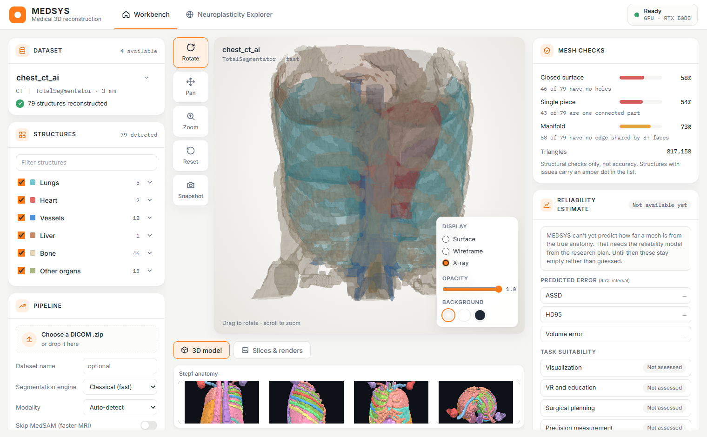
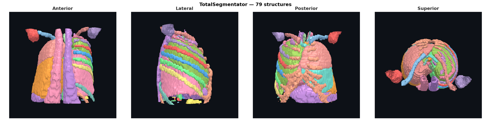
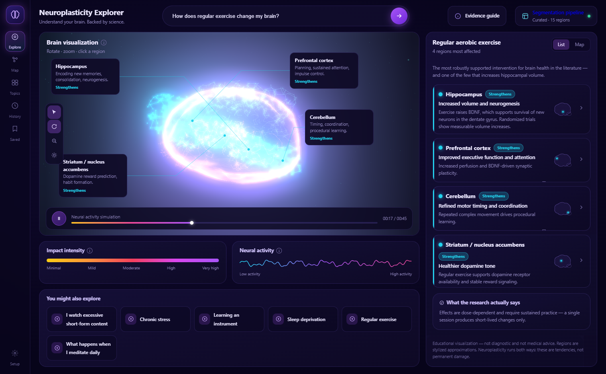
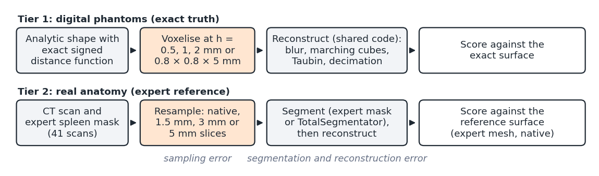
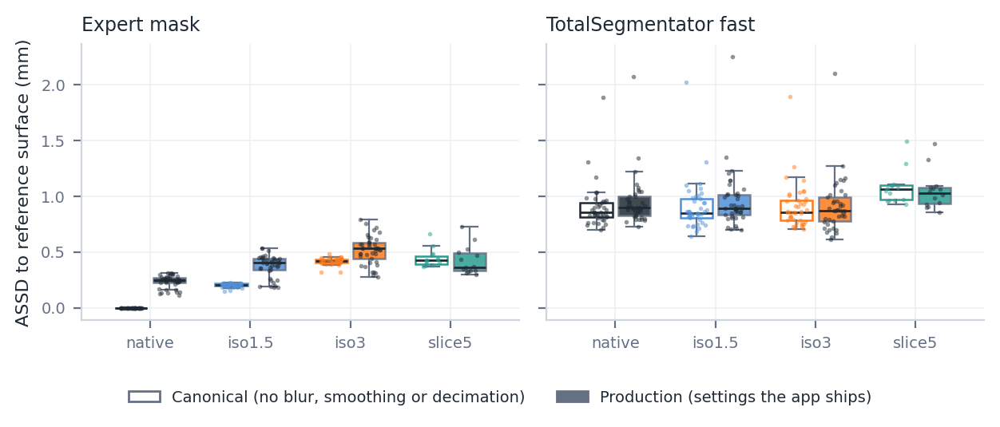

<div align="center">

# MEDSYS

**Risk-aware reconstruction of 3D anatomy from medical scans**

An open platform that turns DICOM studies into per-structure 3D models, and a research project
that measures how far those models can be trusted.

[](LICENSE)
[](#requirements)
[](https://github.com/Organic42/MEDSYS/actions/workflows/python-app.yml)
[](https://github.com/Organic42/MEDSYS/releases/tag/v1.0-paper)
[](#status)

[Product](#the-product) · [Results](#research-results) · [Paper](#paper) · [Reproduce](#reproducing-the-results) · [Run it](#running-medsys) · [Roadmap](#roadmap) · [Cite](#citation)

<br>



<sub>The workbench on a chest CT segmented by TotalSegmentator: 79 structures in X-ray mode, with live structural checks of every mesh on the right.</sub>

</div>

---

> **Not a medical device.** MEDSYS is for research and education. It is not cleared or certified
> for clinical use and must not inform diagnosis or treatment. See [Disclaimer](#disclaimer).

## At a glance

| | |
|---|---|
| **23,832** | meshes scored against exact or expert reference surfaces |
| **41** | expert-labelled CT scans, each resampled to 4 acquisition resolutions |
| **0.177 mm** | surface error added per mm of lost sampling (95% CI 0.171–0.184) |
| **89.5%** | of an AI engine's surface-error variance that is patient-to-patient |
| **66% → 95%** | closed meshes when TotalSegmentator output is meshed on its own 3 mm grid |
| **17.7×** | GPU speed-up of MedSAM refinement (432.8 s → 24.5 s) |
| **91** | automated tests |

## The product

Upload a zipped DICOM study in the browser. MEDSYS detects the modality, segments it, builds one
3D mesh per structure and opens the result in a three-column workbench.



<sub>Pipeline output for the same chest CT: anterior, lateral, posterior and superior views of all 79 structures.</sub>

| | |
|---|---|
| **Modalities** | CT, MRI (brain) and PET, routed automatically from DICOM metadata |
| **Engines** | A fast classical engine (intensity thresholds, BET, Gaussian mixture) and TotalSegmentator (nnU-Net) for 100+ labelled structures, with MedSAM refinement for MRI |
| **Workbench** | Dataset, structures and pipeline on the left; a 3D stage with surface, wireframe and X-ray modes in the centre; mesh checks, the reliability estimate and reference metrics on the right |
| **Measured, not guessed** | Mesh checks show real structural data (on the CT above: 46 of 79 meshes closed, 43 of 79 in one piece, 58 of 79 manifold, 817,158 triangles). The reliability estimate stays empty until the research supports it, rather than showing invented numbers |
| **Neuroplasticity Explorer** | Questions about behaviour and the brain, answered from a curated evidence base and mapped onto a 3D brain |
| **Deployment** | Docker Compose (API, Redis and workers), a lightweight Hugging Face Spaces image, and a standalone Windows build |



<sub>The Neuroplasticity Explorer: asking how regular exercise changes the brain highlights the four regions most affected and tags each finding by the strength of its evidence.</sub>

## Research question

Automated pipelines can turn a CT scan into a 3D model in minutes, but they do not say how far
that model's surface may be from the real anatomy. Error enters at every stage (acquisition
resolution, segmentation, blurring, surface extraction, smoothing, simplification), and the
stages interact. The thesis is **measure → predict → decide**:

| | Question | Status |
|---|---|---|
| **RQ1 — Measure** | Which pipeline stages, and which interactions between them, contribute most to final geometric error? | Phantoms and 41 expert-labelled CT scans done; a second dataset (CT-ORG) next |
| **RQ2 — Predict** | Can final-mesh error be predicted without ground truth, with calibrated coverage? | Planned |
| **RQ3 — Decide** | Can those predictions select the cheapest pipeline that meets a task's accuracy requirement? | Planned |

Production and research run the same reconstruction code ([`reconstruction.py`](reconstruction.py)),
so every result below describes the meshes the app actually ships.

## Research results



Two references, one factorial design. **Tier 1** reconstructs four analytic phantoms (sphere, thin
capsule, torus, rounded box) at four voxel spacings under 97 configurations, 7,760 meshes, and
scores them against their exact surfaces. **Tier 2** resamples 41 expert-labelled spleen CT scans
(Medical Segmentation Decathlon) to four resolution levels *before* segmentation, segments them
with TotalSegmentator, and reconstructs both the expert mask and the engine's mask under 49
configurations, 16,072 meshes, scored against the expert surface.

### Tier 2: what resolution does to a correct segmentation and to an AI engine

Mean across scans; distances are ASSD in mm against the expert reference surface; `slice5` covers
the 14 scans it actually resampled.

| Source | Resolution | Dice | ASSD, canonical | ASSD, production | Closed meshes |
|---|---|---|---|---|---|
| Expert mask | native | – | 0.000 | 0.234 | 98% |
| | 1.5 mm | 0.985 | 0.204 | 0.374 | 95% |
| | 3 mm | 0.968 | 0.418 | 0.517 | 98% |
| | 5 mm slices | 0.971 | 0.445 | 0.425 | 93% |
| TotalSegmentator (fast) | native | 0.940 | 0.901 | 0.948 | 66% |
| | 1.5 mm | 0.940 | 0.905 | 0.958 | 90% |
| | 3 mm | 0.940 | 0.907 | 0.914 | 95% |
| | 5 mm slices | 0.926 | 1.079 | 1.048 | 50% |



**Key findings**

- **Coarser scans move even a perfect segmentation, and Dice hides it.** The expert mask's surface
  moves 0.20, 0.42 and 0.45 mm at 1.5 mm, 3 mm and 5 mm slices while Dice stays at or above 0.968.
- **A simple sampling relationship.** That movement follows ASSD ≈ 0.177 × Δ (95% CI 0.171–0.184,
  R² 0.76), where Δ is the sampling added by coarsening. It predicts held-out scans almost as well
  (leave-one-scan-out R² 0.75, mean absolute error 0.037 mm), and agrees with the 0.14 × voxel floor
  measured on exact phantom surfaces.
- **For an AI engine, the patient dominates.** Patient-to-patient variation explains 89.5% of
  TotalSegmentator's error variance (95% CI 65.0–95.2%; 94.2% in a random-intercept model).
  Its error does not change from native to 3 mm grids (0.901 → 0.907 mm) but rises by 0.188 mm
  with 5 mm slices.
- **Stages interact, so errors cannot simply be added.** On phantoms, interactions carry about a
  third of the error variance, and smoothing helps compact shapes but quadruples the thin capsule's
  error at 2 mm (0.425 → 1.696 mm).
- **Decimation costs topology, not geometry.** On unsmoothed meshes, removing up to 50% of faces
  leaves the surface unchanged in 34–39 of 41 scans, yet at 75% only 57–83% of meshes stay closed.
- **A practical fix.** Meshing TotalSegmentator's output on its own 3 mm grid raises closed meshes
  from 66% to 95% and cuts the median mesh from 19,520 to 2,600 faces. At identical physical
  settings, the accuracy change is negligible (−0.017 mm); the gain is topology and size.

### Tier 1: reconstruction error against exact surfaces

ASSD in mm (HD95 in brackets) of the canonical reconstruction, mean of five placements. It is
about 0.14 × the voxel size and sets the floor below which anatomy results cannot be interpreted.

| Phantom | 0.5 mm | 1 mm | 2 mm | 0.8 × 0.8 × 5 mm |
|---|---|---|---|---|
| Sphere | 0.070 (0.17) | 0.147 (0.34) | 0.271 (0.75) | 0.495 (1.62) |
| Capsule, r 2 mm | 0.069 (0.17) | 0.144 (0.35) | 0.331 (0.77) | 0.634 (1.95) |
| Torus | 0.068 (0.16) | 0.138 (0.33) | 0.278 (0.66) | 0.499 (1.61) |
| Rounded box | 0.072 (0.17) | 0.145 (0.33) | 0.297 (0.68) | 0.525 (1.72) |

Voxel spacing is the largest factor (38.8% of error variance, 95% CI 36.1–42.0%; 68.6% on a log
scale). The app's default settings shrink the 2 mm capsule by 1.13 mm at 2 mm voxels, more than
half its radius, because their blur is set in voxels.

### Compute cost

One 192-slice 1 mm brain MRI on an RTX 5080 (16 GB) and a 6-core CPU, PyTorch 2.12 with CUDA 13.0.

| Stage | CPU | GPU | Speed-up |
|---|---|---|---|
| MedSAM refinement | 432.8 s | 24.5 s | 17.7× |
| Whole MRI pipeline | 540 s | 132 s | 4.1× |
| TotalSegmentator MRI, fast (3 mm) | 24.2 s | 29.2–30.5 s warm | none |
| TotalSegmentator MRI, full (1.5 mm) | 60.2 s | 38.7 s warm | 1.6× |

On CT, TotalSegmentator fast mode took 17–30 s per scan on the GPU across the 96 Tier 2 runs.

## Paper

**Stage-Wise Attribution of Geometric Error in Automatic Anatomical Surface Reconstruction From
Computed Tomography.** Sameer Morya and Sarthak Wage. IEEE conference format, 6 pages.

- PDF: [`docs/paper/medsys-paper.pdf`](docs/paper/medsys-paper.pdf), also attached to release
  [`v1.0-paper`](https://github.com/Organic42/MEDSYS/releases/tag/v1.0-paper)
- Source and reproduction steps: [`docs/paper/`](docs/paper/)
- Longer Tier 2 report: [`docs/tier2-report/`](docs/tier2-report/)

## Reproducing the results

Every table and figure is generated from the saved per-mesh results in
[`research/results/`](research/results/), so they can be rebuilt without re-running the experiments.

```bash
pip install -r requirements-full.txt

# Rebuild the paper's statistics, tables and figures from the saved results
python -m research.paper_stats --tier1 research/results/tier1_phantoms_20261002-222422_full \
       --tier2 research/results/tier2_spleen_resolution_20261004-214129 --out docs/paper

# Or re-run the experiments (seed 2026)
python -m research.phantom_experiment --preset full      # 7,760 meshes, about 3 min on 6 cores
python -m research.tier2 --dataset msd_spleen --data data/msd/Task09_Spleen --preset full --workers 5

# Tests
pytest                                                   # 91 tests
```

Full commands, software versions and a map from each paper item to its source:
[`docs/paper/README.md`](docs/paper/README.md). Experiment details:
[`research/README.md`](research/README.md).

## Running MEDSYS

```bash
pip install -r requirements-full.txt
python app.py                         # http://127.0.0.1:8000

docker compose up --build             # API + Redis + workers
python segmentation_pipeline.py --input <dicom_dir> --name <dataset> --engine totalseg
```

<details>
<summary><strong>Deployment options</strong></summary>

<br>

- **Hugging Face Spaces:** `Dockerfile.web` with `requirements-web.txt` builds a CPU-only image
  without PyTorch or TotalSegmentator; the front matter at the top of this file configures the
  Space. The UI detects missing engines through `/api/capabilities`.
- **Windows:** `python -m PyInstaller medsys.spec --noconfirm` produces `dist/MEDSYS/`, which runs
  without Python.
- **GPU:** install a CUDA build of PyTorch that supports your card. RTX 50-series cards need
  CUDA 12.8 or newer. Jobs fall back to the CPU when no GPU is found.

</details>

<details>
<summary><strong>Pipelines</strong></summary>

<br>

- **CT (classical):** Hounsfield units → windowing → body mask → lungs (border clearing) →
  skeleton (HU > 200) → soft tissue → meshes.
- **MRI brain (classical):** N4 bias correction → non-local-means denoising → BET skull strip →
  optional box-prompted MedSAM refinement → grey/white matter/CSF by Gaussian mixture → meshes.
- **PET:** activity normalisation → hotspot by tumour-to-background ratio → maximum-intensity
  projections and meshes.
- **TotalSegmentator:** DICOM → NIfTI → nnU-Net (CT or MR task, 3 mm fast mode in the app) →
  one mesh per structure.

Every route meshes through [`reconstruction.py`](reconstruction.py): Gaussian blur of the mask,
marching cubes, Taubin smoothing and decimation, with explicit, recordable parameters.

</details>

<details>
<summary><strong>Architecture</strong></summary>

<br>

```
Browser ──upload──▶ FastAPI (app.py) ──▶ job queue (in-process, or Redis + RQ)
                                              │
                                              ▼
                      segmentation_pipeline.py (subprocess per job)
                      ├─ modality detection and routing
                      ├─ classical engine / TotalSegmentator
                      └─ reconstruction.py ──▶ meshes + report.json
                                              │
              SQLite job store ◀──────────────┤
                                              ▼
                      Workbench (three.js) ◀── /api/datasets, /output/<dataset>/*.stl
```

Job state lives in SQLite, so it survives restarts and is shared by the API and workers. Each
segmentation runs as a subprocess, so a crashing job cannot take the service down.

</details>

## Repository structure

```
MEDSYS/
├── reconstruction.py          # Shared mesh reconstruction (production and research)
├── segmentation_pipeline.py   # Modality-aware segmentation pipelines
├── validate.py                # Reference comparison: Dice, IoU, HD95, ASSD
├── research/                  # Tier 1 and Tier 2 experiments, metrics, paper statistics
│   └── results/               # Per-mesh results behind the paper (compressed)
├── docs/
│   ├── paper/                 # The paper: LaTeX, figures, PDF, reproduction steps
│   ├── tier2-report/          # Detailed Tier 2 report
│   └── images/                # README screenshots and figures
├── tests/                     # 91 tests: pipeline, phantoms, metrics, Tier 2, paper statistics
├── app.py, tasks.py, worker.py, jobstore.py, config.py   # Web service and job handling
├── web/                       # Workbench and Neuroplasticity Explorer
├── brain_knowledge.py         # Explorer evidence base
└── Dockerfile, Dockerfile.web, docker-compose.yml, requirements*.txt
```

## Roadmap

**Research**
- [x] Tier 1: phantom experiment with exact surfaces
- [x] Tier 2: 41 expert-labelled CT scans with acquisition resolution as a factor
- [x] Scan-clustered attribution and validation of the sampling relationship
- [x] Paper draft (IEEE conference format)
- [ ] Second, held-out dataset: CT-ORG (liver, lungs, bone)
- [ ] TotalSegmentator full-resolution (1.5 mm) model
- [ ] Systematic, logged literature search to confirm novelty
- [ ] RQ2: ground-truth-free error prediction with calibrated intervals
- [ ] RQ3: accuracy-constrained pipeline selection

**Platform**
- [x] Shared, parameterised reconstruction module
- [x] GPU inference with measured CPU and GPU timings
- [x] Browser-side mesh checks
- [ ] Mesh TotalSegmentator output on its working grid (confirm on CT-ORG first)
- [ ] Blur specified in millimetres in production
- [ ] Verified de-identification and opaque dataset identifiers
- [ ] DICOM-SEG export and a provenance record on every output

## Status

A working research prototype. The platform runs end to end and its 91 tests pass. RQ1 has results
on phantoms and on one organ (spleen, 41 scans); a second dataset is next.

**Limitations.** Real-anatomy results cover one organ, one dataset and TotalSegmentator's fast mode.
Coarser acquisition was simulated by resampling, not by rescanning. The reference surfaces carry
the native scan's own sampling error, so differences below about 0.2–0.5 mm cannot be called
anatomical error. No claim here should be read as clinical accuracy.

## Requirements

- Python 3.10+
- `requirements-full.txt` for all engines; `requirements-web.txt` for the lightweight image
- Optional: an NVIDIA GPU with a matching CUDA build of PyTorch (MedSAM and TotalSegmentator)
- Optional: Docker

## Citation

```bibtex
@misc{morya2026medsys,
  author = {Morya, Sameer and Wage, Sarthak},
  title  = {Stage-Wise Attribution of Geometric Error in Automatic Anatomical Surface
            Reconstruction From Computed Tomography},
  year   = {2026},
  note   = {MEDSYS, release v1.0-paper},
  url    = {https://github.com/Organic42/MEDSYS}
}
```

MEDSYS builds on TotalSegmentator (Wasserthal et al., *Radiology: Artificial Intelligence*, 2023),
nnU-Net (Isensee et al., *Nature Methods*, 2021), MedSAM, BET, N4ITK and marching cubes, and the
Tier 2 data come from the Medical Segmentation Decathlon (Antonelli et al., *Nature
Communications*, 2022); please cite them where you use them.

## Authors

- **Sameer Morya**
- **Sarthak Wage** ([Organic42](https://github.com/Organic42))

Issues and pull requests are welcome. Please run `pytest` before submitting, and never commit
patient data, DICOM files, model checkpoints or pipeline output (`.gitignore` excludes them).

## Disclaimer

MEDSYS is provided for **research and education only**. It is not a medical device, has not been
evaluated by any regulatory body, and must not be used to diagnose, treat or otherwise make
clinical decisions. Outputs from any engine may contain errors. Always defer to qualified
clinicians and validated clinical software.

## License

MIT. See [LICENSE](LICENSE). Tier 2 results in `research/results/` are derived from CC-BY-SA 4.0
data and shared under that licence.
